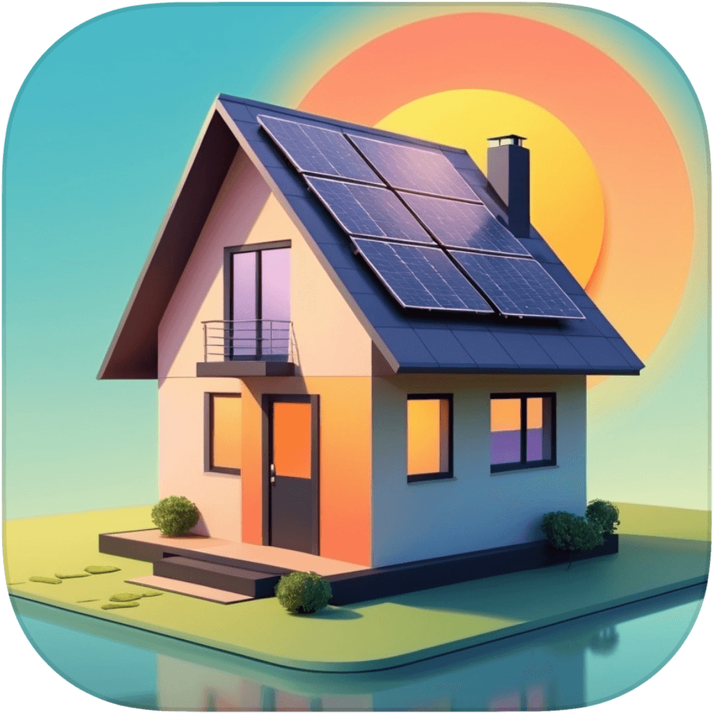
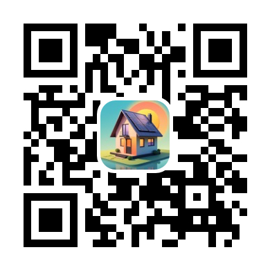

<h1>
   SolarManagerWatch 
</h1>

## Description

Solar Lens is a powerful app that gives you a comprehensive overview of your home's energy consumption. Easily monitor the production of solar power, total consumption, battery level, and power flow between your home and the grid.

### Key Features:

- Real-time monitoring: Track your solar energy usage in real-time and the flow of energy through your house.
- Compatibility: Works seamlessly with Solar Manager systems.
- User-friendly interface: Easily navigate and understand your energy data.

### Requirements:

- You need a login to an existing Solar Manager installation.
- watchOS 18

### Disclaimer

- Solar Lens is not affiliated with Solar Manager AG. The app is designed to work with Solar Manager systems, but it is a separate product developed by Marc Dürst.

A standalone Apple Watch App showing basic information from *Solar Manager* like the overview of the house energy flow, the solar production and some consumption information.

# Technology

* XCode
* Swift
* Swift UI
