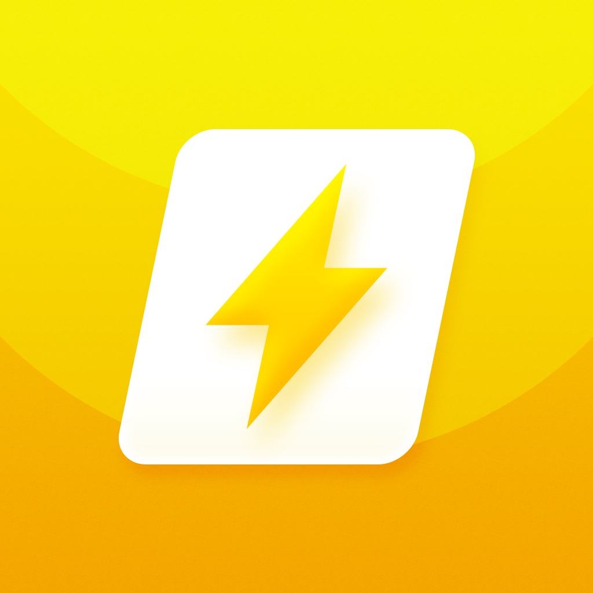

  

<h1 align="center">Solar Lens</h1>

  An alternative native Apple client for <a href="https://solar-manager.ch">Solar Manager</a> energy systems. 
  <a href="https://solarlens.ch">Website</a> · <a href="https://apple.co/408SKri">App Store</a> · <a href="https://github.com/mduu/SolarManagerWatch/wiki">Documentation</a>

  

## About

Solar Lens brings your Solar Manager energy system deep into the Apple ecosystem. Instead of a technical monitoring tool, Solar Lens provides an approachable, everyday interface for homeowners who want to understand and control their energy — without needing an engineering degree.

### What makes Solar Lens different

- **Apple ecosystem integration** — Not just an iPhone app, but a full suite: Apple Watch, iPhone, iPad, Apple TV, widgets, Smart Stack, watch complications, Siri, and Shortcuts. Your energy data is always one glance or voice command away.
- **Designed for daily use** — A clean, intuitive interface that focuses on what matters. Less technical jargon, more clarity — built for people who want to *use* their solar system, not *debug* it.
- **Features beyond Solar Manager** — Extensive statistics, weekly overviews, efficiency metrics, and visualizations that the official Solar Manager app doesn't offer.

### Key Features

- **Real-time monitoring** — Track solar production, consumption, and energy flow as it happens
- **Apple Watch** — Full-featured watchOS app with energy flow, battery, solar, charging, and grid views
- **Widgets & Smart Stack** — Glanceable energy data on your home screen, lock screen, and watch face
- **Siri & Shortcuts** — "Hey Siri, how much solar am I producing?" — plus full Shortcuts automation
- **Apple TV dashboard** — A living room display of your energy system with custom backgrounds
- **Extensive statistics** — Weekly and monthly breakdowns, efficiency metrics, and trend analysis
- **EV charging control** — Monitor and switch charging modes directly from any device
- **Battery management** — View battery state and control charging strategies

### Requirements

- A login to an existing [Solar Manager](https://solar-manager.ch) installation
- watchOS 11+ / iOS 18.2+ / tvOS

### Disclaimer

Solar Lens is not affiliated with Solar Manager AG. It is an independent product developed by Marc Dürst.

## Support

- Documentation: [Wiki](https://github.com/mduu/SolarManagerWatch/wiki)
- Report issues or ask questions: [Issues](https://github.com/mduu/SolarManagerWatch/issues)
- Planned features: [Project Board](https://github.com/users/mduu/projects/2/views/1)

## Project Structure

| Directory | Description |
|-----------|-------------|
| `Solar Lens iOS/` | iOS app (iPhone/iPad) — dashboard, statistics, settings |
| `Solar Lens Watch App/` | watchOS app — energy flow, battery, solar, consumption, charging, grid |
| `Solar Lens BigScreen/` | tvOS app — full dashboard with custom backgrounds |
| `Solar Lens Widgets/` | watchOS widgets and complications |
| `Solar Lens iOS Widgets/` | iOS home screen widgets |
| `Shared/` | Shared Swift code — services, state, components, features, widgets, app intents |
| `Solar Lens Server/` | .NET Azure Functions backend (image upload for tvOS) |
| `landingpage/` | Marketing website ([solarlens.ch](https://solarlens.ch)) |
| `externals/` | Solar Manager OpenAPI specifications |
| `specs/` | [Architecture](specs/architecture.md), [UI guidelines](specs/userinterface.md), [risks](specs/risks.md), [backlog](specs/backlog.md), [Solar Manager API](specs/solarmanager_api.md), stories, and ADRs |

## Technology

- **Swift / SwiftUI** — UI across all platforms
- **WidgetKit** — Widgets and complications
- **AppIntents** — Siri Shortcuts
- **KeychainAccess** — Secure credential storage
- **.NET / Azure Functions** — Server-side image upload (tvOS only)
